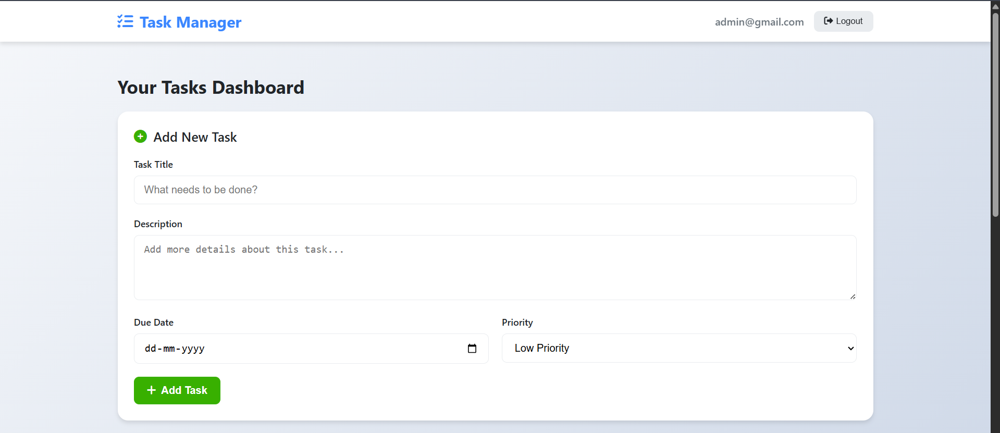
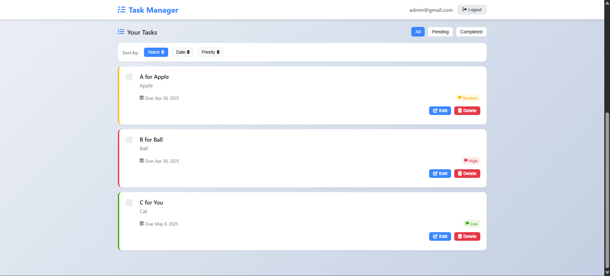
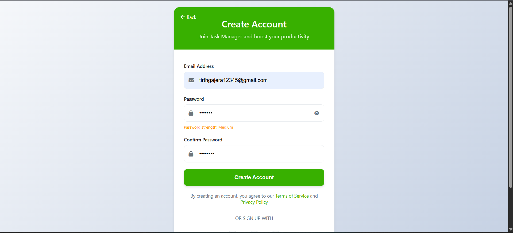
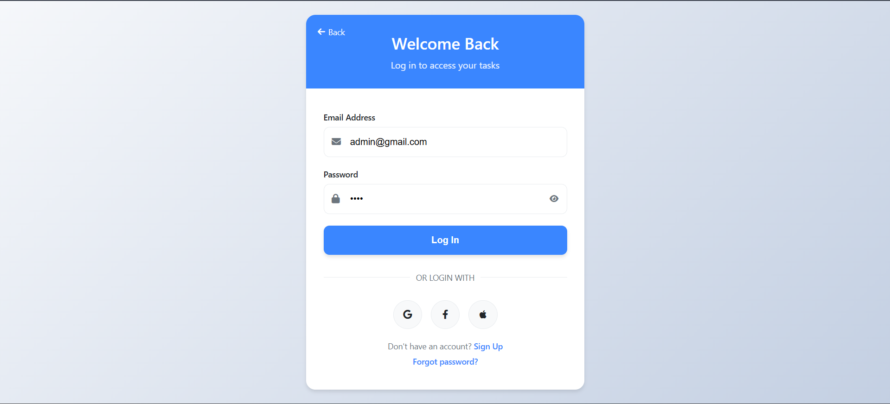
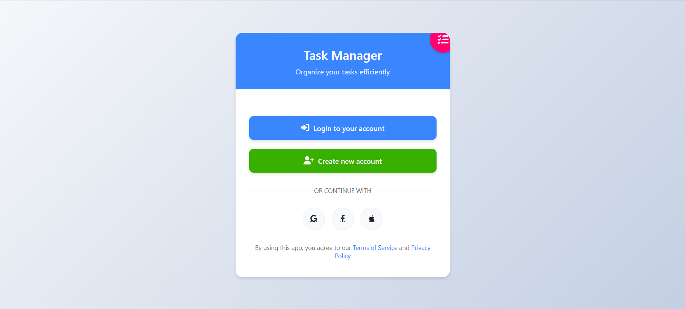

# ✅ Task Manager

A full-featured **To-Do / Task Management App** built using **Node.js**, **MongoDB**, **Angular**, and **CSS**.  
This app helps users stay organized with an intuitive interface, task priority levels, sorting capabilities, and full authentication.

---

## 🔥 Features

- 🔐 User Authentication (Login, Signup, Logout)
- 📝 Add/Edit/Delete Tasks
- 📆 Each Task includes:
  - **Title**
  - **Description**
  - **Due Date**
  - **Priority** (Green = Low, Yellow = Medium, Red = High)
- ✅ Mark Tasks as **Completed** or **Pending**
- 🔍 Sort & Filter Options:
  - Sort by **Due Date**
  - Sort by **Title**
  - Sort by **Priority**
  - Filter by **Status**: Completed / Pending

---

## 💻 Tech Stack

| Frontend | Backend | Database |
|----------|---------|----------|
| Angular  | Node.js | MongoDB  |

Other tools and libraries:
- Express.js (backend routing)
- Mongoose (MongoDB ORM)
- CSS (custom styles)

---

## 🖼️ Screenshots

> 📸 To show your UI, save screenshots in a `/screenshots` folder and update the paths below:

### 🏠 Dashboard

### ➕ Login & Sign Up

### 📋 Index Page

---

## 🙌 Author

Made with ❤️ by **Tirth Gajera**  

---

## 📃 License

This project is licensed under the **MIT License** – see the [LICENSE](LICENSE) file for details.
